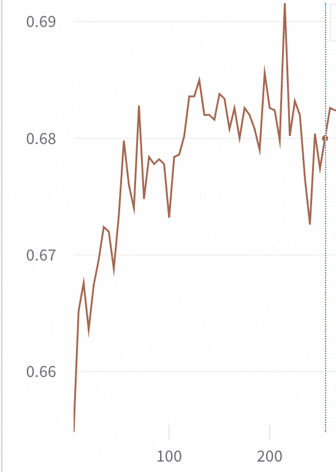

# 基于Mcore版本Verl的端到端GRPO训练流程

本文档提供使用Verl、Mcore 和 vLLM 框架来对Moonlight模型进行GRPO训练的快速开始指南。

## 开发环境配置
建议在PAI平台DSW环境中基于nvcr.io/nvidia/pytorch:24.12-py3来构建镜像。
```bash
#安装VLLM, Transformers等Chatlearn的依赖包
pip install modelscope==1.30.0 tensordict==0.10.0 torchdata==0.11.0 codetiming==1.4.0 vllm==0.8.5 transformers==4.56.2 blobfile==3.0.0 numpy==1.26.4 accelerate==1.10.0 wandb==0.19.11 datasets==3.6.0 grpcio==1.71.0 omegaconf==2.3.0  hydra-core==1.3.2 msgspec==0.19.0 mathruler==0.1.0 pylatexenc==2.10 langgraph==0.6.6 ray[default]==2.46.0 -i https://mirrors.aliyun.com/pypi/simple/ 

#由于安装VLLM会重新安装pytorch，因此需要重新安装flash attention以及apex
pip uninstall -y flash_attn && pip install https://pai-vision-data-hz.oss-cn-zhangjiakou.aliyuncs.com/csrc/flash-attention/torch2.6.0-cu12x/flash_attn-2.4.2-cp312-cp312-linux_x86_64.whl --no-cache-dir -i https://mirrors.aliyun.com/pypi/simple/ 

pip uninstall -y apex && pip install https://pai-vision-data-hz.oss-cn-zhangjiakou.aliyuncs.com/csrc/apex/torch2.6.0-cuda12x/apex-0.1-cp312-cp312-linux_x86_64.whl --no-cache-dir -i https://mirrors.aliyun.com/pypi/simple/ 

#升级Transformer Engine
pip uninstall -y transformer-engine transformer-engine-cu12 transformer-engine-torch
git clone --recursive https://github.com/NVIDIA/TransformerEngine.git
cd TransformerEngine
git submodule update --init --recursive
git checkout release_v2.7
export CUDNN_PATH=/usr/local/lib/python3.12/dist-packages/nvidia/cudnn/
cp /usr/local/lib/python3.12/dist-packages/nvidia/cudnn/include/*  /usr/local/cuda/include/
python setup.py bdist_wheel  -vvv
cd dist
export NVTE_FRAMEWORK=pytorch 
pip install transformer_engine-2.7.0-cp312-cp312-linux_x86_64.whl --no-cache-dir -i https://mirrors.aliyun.com/pypi/simple/ --trusted-host mirrors.cloud.aliyuncs.com

#升级CUDNN，用以解决MLA模型训练时出现的问题
pip install -U nvidia-cudnn-cu12==9.8.0.87 -i http://mirrors.cloud.aliyuncs.com/pypi/simple --trusted-host mirrors.cloud.aliyuncs.com

#我们也提供了预先构建好的镜像协助您快速测试
dsw-registry.cn-shanghai.cr.aliyuncs.com/pai-training-algorithm/chatlearn:torch2.6.0-vllm0.8.5-te2.7-ubuntu24.04-cuda12.6-py312

```

## 代码准备
```bash
git clone --recurse-submodules https://github.com/alibaba/Pai-Megatron-Patch.git
```

## 数据&模型准备
以[MATH-lighteval](https://www.modelscope.cn/datasets/AI-ModelScope/MATH-lighteval)数据集作为示例.
```bash
# 下载数据集
mkdir -p /mnt/data/datasets
modelscope download --dataset AI-ModelScope/MATH-lighteval --local_dir dataset/MATH-lighteval
cd ~/Pai-Megatron-Patch/toolkits/verl_data_preprocessing
python math_lighteval.py --input_dir dataset/MATH-lighteval --local_dir dataset/MATH-lighteval

# 下载模型权重
modelscope download --model moonshotai/Moonlight-16B-A3B-Instruct --local_dir /mnt/data/ckpts/huggingface/Moonlight-16B-A3B-Instruct
```

## 代码&CKPT修改
```bash
vim ~/Pai-Megatron-Patch/backends/megatron/Megatron-LM-250908/megatron/core/models/gpt/gpt_layer_specs.py
145行修改为：
linear_q_down_proj=backend.linear() -> linear_q_down_proj=backend.column_parallel_linear()
linear_kv_down_proj=backend.linear() -> linear_kv_down_proj=backend.column_parallel_linear()

#Moonlight模型的config.json需要做如下的改进: 将"AutoModel"和"AutoModelForCausalLM"的值分别修改为modeling_deepseek_pai.DeepseekV3Model，modeling_deepseek_pai.DeepseekV3ForCausalLM
cp ~/Pai-Megatron-Patch/examples/moonlight/modeling_deepseek_pai.py /mnt/data/ckpts/huggingface/Moonlight-16B-A3B-Instruct

```


## 模型转换

模型格式转换可以参考 [Pai-Megatron-Patch](https://github.com/alibaba/Pai-Megatron-Patch) 项目提供的转换脚本。
高性能分布式权重转换可以参考：https://github.com/alibaba/Pai-Megatron-Patch/tree/main/toolkits/distributed_checkpoints_convertor


例如，使用下述脚本将16B量级的Moonlight的Huggingface格式的模型转换到MCore格式
```bash
git clone --recurse-submodules https://github.com/alibaba/Pai-Megatron-Patch.git
cd ~/Pai-Megatron-Patch/toolkits/distributed_checkpoints_convertor
bash scripts/moonlight/run_2xH20.sh \
16B \
/mnt/data/ckpts/huggingface/Moonlight-16B-A3B-Instruct \
/mnt/data/ckpts/mcore/Moonlight-16B-A3B-Instruct-to-mcore \
false \
true \
bf16
```

## Moonlight强化学习训练以及训练稳定性指引

运行以下命令开始训练：

```bash
cd ~/Pai-Megatron-Patch/examples/moonlight
bash run_mcore_moonlight_verl.sh
```

在解决了一些训练不稳定的问题后，验证集升的评估指标仍然有提升，而不会出现如下图灰色曲线所示的坍塌的现象。
<p align="center">
  <picture>
    
  </picture>
</p>