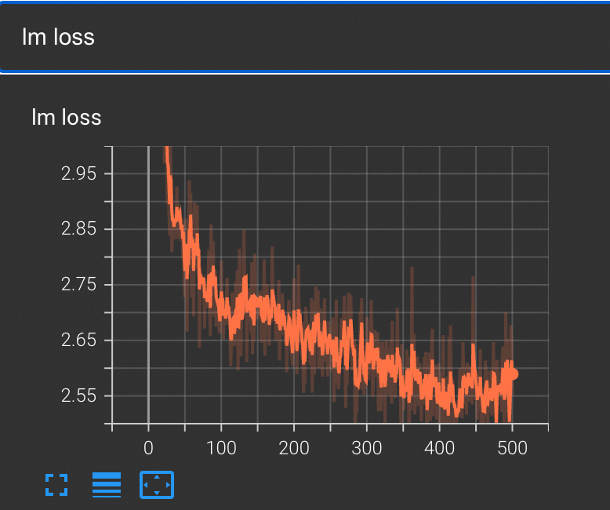

# Qwen3-VL模型在Pai-Megatron-Patch的最佳实践

## Table of Contents
   * [安装](#安装)
   * [数据集&模型下载](#数据集和模型下载)
   * [Megatron-Core模型训练流程](#Megatron-Core模型训练流程)
      * [模型格式转换](#模型格式转换)
      * [模型微调](#Qwen3-VL-30B-A3B微调示例)
      * [模型评测](#Qwen3-VL-30B-A3B评测示例)

## 安装

请在阿里云人工智能平台PAI产品中填写专属镜像地址： `dsw-registry.cn-wulanchabu.cr.aliyuncs.com/pai/pai-megatron-patch:25.01` 

然后安装modelscope并升级`transformers`及`multi-storage-client`的版本
```
pip install modelscope==1.30.0
pip install transformers==4.57.1
pip install -U multi-storage-client
```
随后运行下列代码克隆Pai-Megatron-Patch
```bash
cd /workspace
git clone --recurse-submodules https://github.com/alibaba/Pai-Megatron-Patch.git
```

## 数据集和模型下载

```bash
cd /mnt
mkdir qwen3-vl-ckpts
modelscope download --model Qwen/Qwen3-VL-30B-A3B-Instruct  --local_dir Qwen3-VL-30B-A3B-Instruct
cd ..

mkdir llava-datasets
cd llava-datasets
git clone https://huggingface.co/datasets/liuhaotian/LLaVA-Pretrain
cd LLaVA-Pretrain
unzip images.zip

#convert to webdataset format:
cd /workspace/Pai-Megatron-Patch/toolkits/pretrain_data_preprocessing
python convert_llava_pretrain_to_wds.py /mnt/llava-datasets/LLaVA-Pretrain/

#convert to megatron-energon format:
cd /mnt/llava-datasets/LLaVA-Pretrain/wds
energon prepare ./

#select the following values for the presented options:
> Please enter a desired train/val/test split like "0.5, 0.2, 0.3" or "8,1,1": 9,1,0
> Do you want to create a dataset.yaml interactively? [Y/n]: Y
> Please enter a number to choose a class: 10 (VQAWebdataset)
> Do you want to set a simple field_map[Y] (or write your own sample_loader [n])? [Y/n]: Y
> Please enter a webdataset field name for 'image' (<class 'torch.Tensor'>): jpg
> Please enter a webdataset field name for 'context' (<class 'str'>): json[0][value]
> Please enter a webdataset field name for 'answers' (typing.Optional[typing.List[str]], default: None): json[1][value]
> Please enter a webdataset field name for 'answer_weights' (typing.Optional[torch.Tensor], default: None):
```
为方便起见，我们也提供了处理好的wds文件(26G)用于后续的测试，下载链接如下所示:
```bash
cd /mnt/llava-datasets/LLaVA-Pretrain/
wget https://atp-modelzoo-wlcb-pai.oss-cn-wulanchabu.aliyuncs.com/release/models/pai-megatron-patch/vlm-datasets/wds.tgz
tar -zxf wds.tgz
```

对于视频多模态、单样本中包含多张图片、多轮对话等复杂数据集，您需要将其转换为sharegpt格式数据后再使用Megatron-Patch训练。对于sharegpt格式的数据处理，参见[链接](../../toolkits/multimodal_data_preprocessing/dataset_preparation.md)。


## Megatron-Core模型训练流程
### 模型格式转换
当前qwen3-VL已升级至`torch_dist`格式权重训练，为了进行权重转换，需要传入的参数列表如下
```
MODEL_SIZE=$1               # 模型大小，4B, 8B, A3B, A22B
LOAD_DIR=$2                 # 源权重路径
SAVE_DIR=$3                 # 目标权重路径
MG2HF=$4                    # 转换方向 可选: true, false
USE_CUDA=$5                 # 是否使用GPU转换 建议: true
PR=$6                       # 转换精度 可选: fp32 bf16 fp16
HF_DIR=$7                   # HF权重路径(mcore2hf时必须提供)
```
例如，使用下述脚本将checkpoint转换到MCore格式

```bash
cd /workspace/Pai-Megatron-Patch/toolkits/distributed_checkpoints_convertor
bash scripts/qwen3_vl/run_8xH20.sh \
A3B \
/mnt/qwen3-vl-ckpts/Qwen3-VL-30B-A3B-Instruct \
/mnt/qwen3-vl-ckpts/Qwen3-VL-30B-A3B-Instruct-to-mcore  \
false \
true \
bf16
```


### Qwen3-VL-30B-A3B微调示例

#### 微调命令描述
需要传入的参数列表如下：
```bash
ENV=$1                          # 运行环境配置开关: dsw单机训练训练，dlc表示多机训练环境
MODEL_SIZE=$2                   # 模型结构参数量级: 3B/7B/72B
BATCH_SIZE=$3                   # 一次迭代一个数据并行内的样本数
GLOBAL_BATCH_SIZE=$4            # 一次迭代多个数据并行的总样本数
LR=$5                           # 学习率
MIN_LR=$6                       # 最小学习率
SEQ_LEN=$7                      # 序列长度
PAD_LEN=$8                      # Padding后长度
PR=${9}                         # 训练精度: fp16, bf16, fp8
TP=${10}                        # 模型并行度
PP=${11}                        # 流水并行度
CP=${12}                        # 上下文并行度
SP=${13}                        # 是否启用序列并行: true, false
DO=${14}                        # 是否使用Megatron版Zero-1降显存优化器: true, false
FL=${15}                        # 是否优先使用Flash Attention: true, false
AC=${16}                        # 激活检查点模式: sel, full, offload, false
OPTIMIZER_OFFLOAD=${17}         # 是否启用Offload optimizer: false, 或输入0～1的小数作为参数offload比例
SAVE_INTERVAL=${18}             # 保存ckpt的间隔
DATASET_PATH=${19}              # 训练数据集路径
VALID_DATASET_PATH=${20}        # 验证数据集路径
PRETRAIN_CHECKPOINT_PATH=${21}  # 预训练模型路径
TRAIN_ITERS=${22}               # Iter数
LR_WARMUP_ITERS=${23}           # 预热Iter数        
OUTPUT_BASEPATH=${24}           # 训练输出日志文件路径
```

#### 微调示例
使用以下命令启动对Qwen3-VL-30B-A3B的微调。

```bash
cd /workspace/Pai-Megatron-Patch/examples/qwen3_vl
bash run_mcore_qwen.sh  \
dsw  \
A3B   \
1    \
128 \
1e-5   \
1e-6   \
16384  \
16384  \
bf16  \
4   \
4  \
1 \
1 \
4 \
true \
true \
true   \
false \
false \
100000  \
/mnt/llava-datasets/LLaVA-Pretrain/wds   \
/mnt/llava-datasets/LLaVA-Pretrain/wds   \
/mnt/qwen3-vl-ckpts/Qwen3-VL-30B-A3B-Instruct-to-mcore \
500  \
50   \
/mnt/qwen3-vl-ckpts/sft_output_mcore_Qwen3-VL-30B-A3B
```
微调完成后的loss曲线如下图所示
<p align="center">
  <picture>
    
  </picture>
</p>

### Qwen3-VL-30B-A3B评测示例

我们使用image caption任务来对多模态模型的效果进行评测，原始图像如下图所示：
<p align="center">
  <picture>
    
  </picture>
</p>

接着我们使用以下命令查看没有经过微调的Qwen3-VL-30B-A3B模型的输出效果
```bash
cd /workspace/Pai-Megatron-Patch/examples/qwen3_vl
python inference.py --model-path /mnt/qwen3-vl-ckpts/Qwen3-VL-30B-A3B-Instruct

```
输出结果如下：
```bash
['Of course. Here is a detailed description of the image.\n\nThis is a heartwarming and serene photograph capturing a tender moment between a woman and her dog on a beach at sunset.\n\n- **Main Subjects and Interaction**: The central focus is a woman and a large, light-colored dog, likely a yellow Labrador Retriever, sitting on the sand. The dog is sitting upright, and its right front paw is raised to meet the woman\'s hand in a "high-five" gesture. The woman is sitting cross-legged, smiling warmly at her dog, her face illuminated by the golden sunlight. This interaction conveys a strong bond of companionship, trust, and affection.\n\n- **Setting and Atmosphere**: The scene is set on a wide, sandy beach. In the background, the ocean stretches to the horizon, with a gentle wave cresting and breaking. The time of day is clearly sunset, as evidenced by the low, warm, golden light that bathes the entire scene. This light creates a soft, glowing effect, particularly on the woman\'s hair and the edges of the dog, and casts a warm hue over the sand. The sky is a bright, hazy white, indicating the sun is just below the horizon.\n\n- **Details and Composition**: The woman is wearing a black and white plaid flannel shirt over dark pants. She has a white watch on her left wrist. The dog is wearing a blue harness decorated with small, colorful paw prints. A red leash lies on the sand near them. The composition places the subjects slightly off-center, allowing the vastness of the beach and ocean to create a sense of peace and openness. The overall mood is one of tranquility, joy, and the simple pleasure of a shared moment with a beloved pet.']
```
接下来，我们使用以下命令查看经过微调的Qwen3-VL-30B-A3B模型的输出效果
首先需要将微调后模型转换成HF格式，命令如下：
```bash
cd /workspace/Pai-Megatron-Patch/toolkits/distributed_checkpoints_convertor
bash scripts/qwen3_vl/run_8xH20.sh \
4B \
/mnt/qwen3-vl-ckpts/sft_output_mcore_Qwen3-VL-30B-A3B \
/mnt/qwen3-vl-ckpts/sft_output_hf_Qwen3-VL-30B-A3B  \
true \
true \
bf16 \
/mnt/qwen3-vl-ckpts/Qwen3-VL-30B-A3B-Instruct
```
接着运行同样的推理
```bash
cd /workspace/Pai-Megatron-Patch/examples/qwen3_vl
python inference.py --model-path /mnt/qwen3-vl-ckpts/sft_output_hf_Qwen3-VL-30B-A3B

```

输出结果参考如下：
```bash
['a woman is sitting on the beach with her dog, petting it']
```