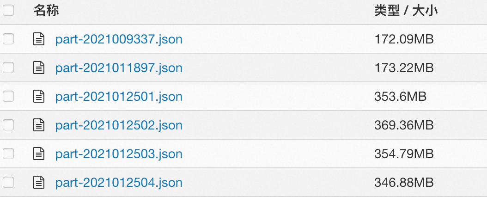

## 数据预处理
建议在灵骏智算平台中的DSW实例中准备预训练数据，本指引将以中文wudao2.0数据集为例，为通义千问qwen模型准备预训练数据：

下载WuDaoCorpora2.0开源数据集到/mnt/workspace/qwen-datasets工作目录下，该文件夹中的原始wudao数据集的格式和大小如下截图所示：


我们提供了部分样例数据作为示例，用户可通过以下命令下载和解压：
```bash
wget https://atp-modelzoo.oss-cn-hangzhou.aliyuncs.com/release/datasets/WuDaoCorpus2.0_base_sample.tgz
tar zxvf WuDaoCorpus2.0_base_sample.tgz
```
以"wudao_200g"作为解压后的目标文件夹命名，
我们为HuggingFace&DeepSpeed训练和MegatronLM训练分别准备了数据预处理流程，您可以根据自己的需要选择不同的处理方式。

### Huggingface&DeepSpeed训练数据准备

1. 对Wudao数据执行数据集清洗并进行文件格式转换，具体流程可参考如下的bash脚本，最终生成汇总的merged_wudao_cleaned.json。

```bash
#! /bin/bash
set -ex
# 请在此处设置工作目录和原始数据所在路径
WORK_DIR=/mnt/workspace
data_dir=/mnt/workspace/qwen-datasets/wudao_200g

#开始数据清洗流程
dataset_dir=$(dirname $data_dir)
mkdir -p ${dataset_dir}/cleaned_wudao_dataset
cd ${WORK_DIR}/PAI-Megatron-Patch/toolkits/pretrain_data_preprocessing
python preprocess_wudao2.py -i ${data_dir} -o ${dataset_dir}/cleaned_wudao_dataset -p 32

# 合并清洗后的数据，移除过程数据
mkdir ${dataset_dir}/wudao
cd ${dataset_dir}/wudao
find ${dataset_dir}/cleaned_wudao_dataset -name "*.json" -exec cat {} + > ${dataset_dir}/wudao/merged_wudao_cleaned.json
rm -rf ${dataset_dir}/cleaned_wudao_dataset
```

脚本执行完成后，qwen-datasets内部文件结构如下，新增一个wudao文件夹：
```plain
qwen-datasets
├── wudao_200g
└── wudao
    └── merged_wudao_cleaned.json
```

2. 利用生成的merged_wudao_cleaned.json文件，生成预训练所需的训练集、验证集。请在下面的脚本中设置训练集占比，比如90%：

```bash
# 请在此处设置训练集的占比
TRAIN_RATE=90

# 开始拆分训练集、测试集，移除过程数据
NUM=$(sed -n '$=' ${dataset_dir}/wudao/merged_wudao_cleaned.json)
TRAIN_NUM=$(($(($NUM/100))*$TRAIN_RATE))
echo "total line of dataset is $NUM, data will be split into 2 parts, $TRAIN_NUM samples for training, $(($NUM-$TRAIN_NUM)) for validation"
split -l $TRAIN_NUM --numeric-suffixes --additional-suffix=.json ${dataset_dir}/wudao/merged_wudao_cleaned.json ${dataset_dir}/wudao/
mv ${dataset_dir}/wudao/00.json ${dataset_dir}/wudao_train.json
mv ${dataset_dir}/wudao/01.json ${dataset_dir}/wudao_valid.json
rm ${dataset_dir}/wudao/merged_wudao_cleaned.json
cd ${WORK_DIR}/PAI-Megatron-Patch/toolkits/pretrain_data_preprocessing
python convert_json_to_list.py
```

脚本执行完成后，qwen-datasets内部文件结构如下，新增两个json文件：

```plain
qwen-datasets
├── wudao_200g
├── wudao_train.json
└── wudao_valid.json
```
至此，huggingface训练所需的json文件准备完成，可以跳转到下一章节的Huggingface&Deepspeed训练流程。

### MegatronLM训练数据准备

mmap数据是一种预先执行tokenize处理的数据格式，可以极大减少训练微调过程中等待数据读入的时间，当数据量极大时，优势显著。

1. 对Wudao数据执行数据集清洗并进行文件格式转换，具体流程可参考如下的bash脚本，最终生成汇总的merged_wudao_cleaned.json。

```bash
#! /bin/bash
set -ex
# 请在此处设置原始数据所在路径
data_dir=/mnt/workspace/qwen-datasets/wudao_200g

#开始数据清洗流程
dataset_dir=$(dirname $data_dir)
mkdir -p ${dataset_dir}/cleaned_wudao_dataset
cd ${WORK_DIR}/PAI-Megatron-Patch/toolkits/pretrain_data_preprocessing
# 此处与上一节不同，增加了key参数设为text
python preprocess_wudao2.py -i ${data_dir} -o ${dataset_dir}/cleaned_wudao_dataset -k text -p 32

# 合并清洗后的数据
mkdir ${dataset_dir}/wudao
cd ${dataset_dir}/wudao
find ${dataset_dir}/cleaned_wudao_dataset -name "*.json" -exec cat {} + > ${dataset_dir}/wudao/merged_wudao_cleaned.json
rm -rf ${dataset_dir}/cleaned_wudao_dataset
```

脚本执行完成后，qwen-datasets内部文件结构如下，新增一个wudao文件夹：

```plain
qwen-datasets
├── wudao_200g
└── wudao
    └── merged_wudao_cleaned.json
```

2. 利用第一节生成的merged_wudao_cleaned.json文件，将数据拆分成若干组并压缩，便于后续实现多线程处理：

```bash
apt-get update
apt-get install zstd

# 此处设置分块数为10，如数据处理慢可设置稍大
NUM_PIECE=10

# 对merged_wudao_cleaned.json文件进行处理
mkdir -p ${dataset_dir}/cleaned_zst/
# 查询数据总长度，对数据进行拆分
NUM=$(sed -n '$=' ${dataset_dir}/wudao/merged_wudao_cleaned.json)
echo "total line of dataset is $NUM, data will be split into $NUM_PIECE pieces for processing"
NUM=`expr $NUM / $NUM_PIECE`
echo "each group is processing $NUM sample"
split_dir=${dataset_dir}/split
mkdir $split_dir
split -l $NUM --numeric-suffixes --additional-suffix=.jsonl ${dataset_dir}/wudao/merged_wudao_cleaned.json $split_dir/

# 数据压缩
o_path=${dataset_dir}/cleaned_zst/
mkdir -p $o_path
files=$(ls $split_dir/*.jsonl)
for filename in $files
do
   f=$(basename $filename)
   zstd -z $filename -o $o_path/$f.zst &
done
rm -rf $split_dir
rm ${dataset_dir}/wudao/merged_wudao_cleaned.json
```

脚本执行完成后，qwen-datasets内部文件结构如下，新增一个cleaned_zst文件夹，每个子文件夹里有10个压缩文件：

```plain
qwen-datasets
├── wudao_200g
├── wudao
└── cleaned_zst
    ├── 00.jsonl.zst
		│   ...
    └── 09.jsonl.zst
```

3. 制作MMAP格式预训练数据集。

在DSW的Terminal中进入代码目录：/mnt/workspace/PAI-Megatron-Patch/toolkits/pretrain_data_preprocessing。查看run_make_pretraining_dataset.sh脚本内容。里面有6个启动参数需要在运行时输入，具体参数列表如下：

```plain
MEGATRON_PATH=$1                   # 设置开源Megatron的代码路径
MEGATRON_PATCH_PATH=$2             # 设置Megatron Patch的代码路径
input_data_dir=$3                  # 打包后的wudao数据集的文件夹路径
tokenizer=$4                       # llamabpe
output_data_dir=$5                 # 输出到bin和idx文件目录
load_dir=$6                        # tokenizer_config.json文件路径
```

运行示例如下所示：

```bash
# 请在此处设置数据集路径和工作路径
export dataset_dir=/mnt/workspace/qwen-datasets
export WORK_DIR=/mnt/workspace

# 分别为训练集、验证集生成mmap格式预训练数据集
cd ${WORK_DIR}/PAI-Megatron-Patch/toolkits/pretrain_data_preprocessing
bash run_make_pretraining_dataset.sh \
/root/Megatron-LM-23.04 \
${WORK_DIR}/PAI-Megatron-Patch/ \
${dataset_dir}/cleaned_zst/ \
qwenbpe \
${dataset_dir}/wudao/ \
${WORK_DIR}/qwen-ckpts/qwen-7b-hf
rm -rf ${dataset_dir}/cleaned_zst
```

脚本执行完成后，qwen-datasets内部文件结构如下，wudao文件夹里有2个名字相同后缀不同的mmap文件：

```plain
qwen-datasets
├── wudao_200g
└── wudao
   ├── wudao_qwenbpe_text_document.bin
   └── wudao_qwenbpe_text_document.idx
```

### 小规模预处理数据下载试用
为方便用户试用，我们也提供了已经处理好的小规模数据，可直接下载使用
```bash
cd /mnt/workspace/qwen-datasets
wget https://atp-modelzoo-wlcb-pai.oss-cn-wulanchabu.aliyuncs.com/release/models/pai-megatron-patch/llama2-datasets/wudao_train.json
wget https://atp-modelzoo-wlcb-pai.oss-cn-wulanchabu.aliyuncs.com/release/models/pai-megatron-patch/llama2-datasets/wudao_valid.json
mkdir -p /mnt/workspace/qwen-datasets/wudao
cd /mnt/workspace/qwen-datasets/wudao
wget https://atp-modelzoo-wlcb-pai.oss-cn-wulanchabu.aliyuncs.com/release/models/pai-megatron-patch/qwen-datasets/wudao_qwenbpe_text_document.bin
wget https://atp-modelzoo-wlcb-pai.oss-cn-wulanchabu.aliyuncs.com/release/models/pai-megatron-patch/qwen-datasets/wudao_qwenbpe_text_document.idx
```
